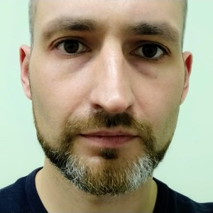

Andrei Yurkouski
================

Front-end developer

### Contacts

*   email: [emp74ark@gmail.com](mailto:emp74ark@gmail.com)
*   phone: [+(48)571-53-23-93](tel:++48571532393)
*   telegram: [@emp74ark](https://t.me/emp74ark)
*   github: [github.com/emp74ark](https://github.com/emp74ark)
*   linkedin: [linkedin.com/in/emp74ark](http://www.linkedin.com/in/emp74ark)

### Languages

*   Russian (native)
*   English B2

About
-----

Enthusiastic and detail-oriented front-end web-developer. Stress resistant. Love good designs and enjoy coding a beautiful UI. Proficient in both individual and collaborative project settings, development using different project management systems (JIRA, YouTrack, GitHub Projects). Know how to cooperate with different sorts of persons or teams.

Work permit in EU: Polska karta pobytu, valid until 08.11.2025.

Competencies
------------

*   HTML
*   CSS / SCSS
*   JavaScript / Typescript
*   ReactJS
*   React Native
*   Redux / Redux Toolkit
*   Angular
*   Styled Components
*   NodeJs / Express
*   MongoDB / PostgresSQL
*   Cypress
*   Git

Projects
--------

**[SpartanGuard](https://spartanguard.co) by Indominus**

*   React, Styled Components, React Query (web)
*   MS Azure (GIT)
*   JIRA

**[RapidFunnel](https://rapidfunnel.com/)**

*   React, MUI (web)
*   React Native, Redux Toolkit (mobile)
*   NodeJs, Express, MongoDB, MySQL (backend)
*   BitBucket (GIT)
*   JIRA

**[Yardooh](https://www.yardooh.com/)**

*   React, TanStack Query, TanStack Router, Vite
*   Docker
*   GitHub Actions
*   BitBucket, GitHub (GIT)
*   JIRA

Education
---------

*   2002-2009: Gomel State Medical University, Internal medicine, Surgery
*   2012: Belarusian Medical Academy of Post-Graduate Education, Interventional cardiologist
*   2022: The Rolling Scopes, JavaScript, [certificate](./certificates/rs_js_2022.pdf)
*   2022: EPAM Upskill Me, JavaScript, [certificate](./certificates/upskillme_2022.pdf)
*   2022: The Rolling Scopes, React, [certificate](./certificates/rs_react_2022.pdf)
*   2023: The Rolling Scopes, Node.js, [certificate](./certificates/rs_nodejs_2023.pdf)
*   2024: The Rolling Scopes, Angular, [certificate](./certificates/rs_angular_2024.pdf)
*   2024: AWS Training
    *   AWS Well-Architected Foundations, [certificate](./certificates/aws-well_architected.pdf)
    *   AWS Cloud Practitioner Essentials, [certificate](./certificates/aws-cloud_practitioner.pdf)
    *   AWS Security Fundamentals Second Edition, [certificate](./certificates/aws-security_fundamentals.pdf)
*   2024: The Rolling Scopes, AWS Fundamentals, [certificate](./certificates/rs_aws_2024.pdf)

I agree to the processing of personal data provide in this document for realizing the recruitment process pursuant to the Personal Data Protection Act of 10 May 2018 (Journal of Laws 2018, item 1000) and in agreement with Regulation (EU) 2016/679 of the European Parliament and of the Council of 27 April 2016 on the protection of natural persons with regard to the processing of personal data and on the free movement of such data, and repealing Directive 95/46/EC (General Data Protection Regulation).

Updated 2025 jan. 25